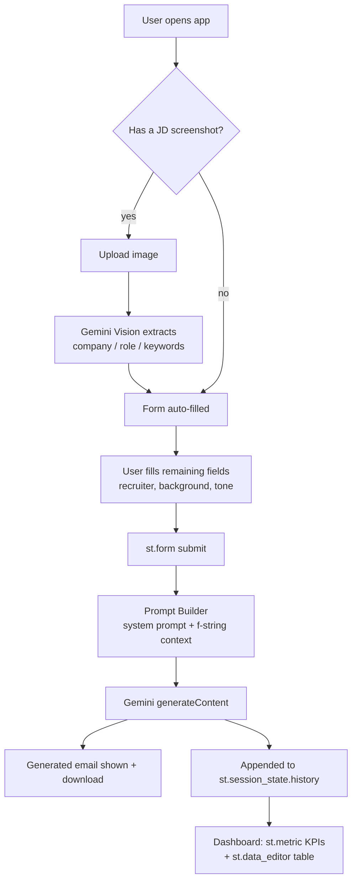

```
 ██████╗ ██████╗ ██╗     ██████╗ ███╗   ███╗ █████╗ ██╗██╗
██╔════╝██╔═══██╗██║     ██╔══██╗████╗ ████║██╔══██╗██║██║
██║     ██║   ██║██║     ██║  ██║██╔████╔██║███████║██║██║
██║     ██║   ██║██║     ██║  ██║██║╚██╔╝██║██╔══██║██║██║
╚██████╗╚██████╔╝███████╗██████╔╝██║ ╚═╝ ██║██║  ██║██║███████╗
 ╚═════╝ ╚═════╝ ╚══════╝╚═════╝ ╚═╝     ╚═╝╚═╝  ╚═╝╚═╝╚══════╝
              AI outreach email generator
```

[](https://python.org)
[](https://streamlit.io)
[](https://ai.google.dev)

> MirAI School of Technology — B.Tech Streamlit & AI Capstone Project

## $ what is this

ColdMail turns "company name + role + your background" into a genuinely
tailored cold outreach email — not a mail-merge template with blanks filled
in. You can also drop in a screenshot of a job posting and Gemini Vision
reads it, pulls out the company, role, and specific requirements, and folds
those into the email automatically.

## $ live demo

> **[ https://ai-summer-internship-mirai-school-of-technology-uvcvmy8rh4ku8c.streamlit.app/ ]**

No API key required to try it — a demo key is wired in via Streamlit Secrets.

## $ features

- 🚀 Tailored email generation via Gemini, not a static template
- 📸 Upload a JD screenshot → Gemini Vision auto-fills company/role + pulls
  out keywords to reference in the email
- 📊 Dashboard with KPI cards (`st.metric`) and an editable history table
  (`st.data_editor`) to track status per email
- 🔗 Shareable pre-filled links via `st.query_params`
- 💾 Session-persistent history, CSV export

## $ architecture



See [`DESIGN.md`](./DESIGN.md) for the full technical design document —
data flow, API integration strategy, and a breakdown of each logic module.

## $ tech stack

| Layer | Tool |
|---|---|
| UI | Streamlit |
| AI — text generation | Gemini 3.6 Flash (`generateContent`) |
| AI — vision extraction | Gemini 3.6 Flash (multimodal input) |
| Data handling | Pandas |
| Deployment | Streamlit Community Cloud |

## $ setup

```bash
git clone https://github.com/<your-username>/cold-email-generator.git
cd cold-email-generator
pip install -r requirements.txt
streamlit run app.py
```

Get a free Gemini API key at [aistudio.google.com](https://aistudio.google.com)
and paste it into the sidebar, or set it as a local secret:

```bash
mkdir .streamlit
cp .streamlit_secrets.toml.example .streamlit/secrets.toml
# then edit .streamlit/secrets.toml with your real key
```

## $ project structure

```
cold-email-generator/
├── app.py                          # main streamlit app
├── requirements.txt
├── DESIGN.md                       # technical design doc
├── .streamlit_secrets.toml.example # secrets format reference
└── .gitignore
```

## $ author

Built by Parikshit for the MirAI School of Technology capstone.